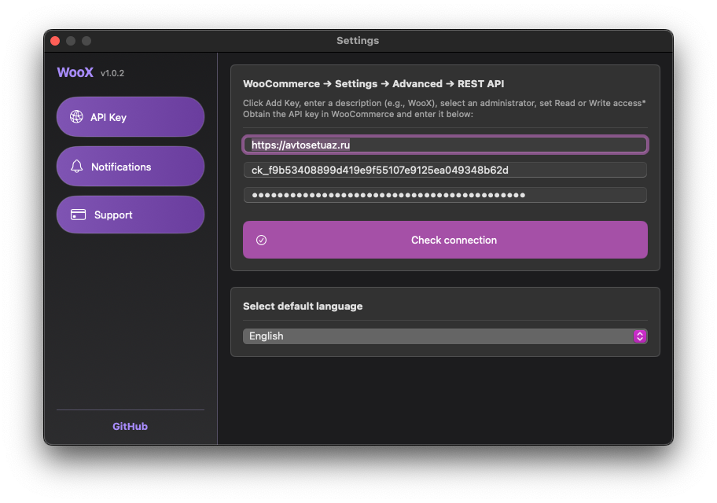

ё# ✨ WooX — Менеджер WooCommerce для macOS
  
**WooX** — это стильное и удобное приложение для macOS, которое интегрируется с **WooCommerce**. Оно позволяет получать уведомления и быстро просматривать информацию о магазине прямо из строки меню.  

## Подключение
Создайте ключ, `WooCommerce → Настройки → Дополнительно → REST API`
- `siteURL` - URL вашего магазина
- `consumerKey` - Ключ доступа к WooCommerce API
- `consumerSecret` - Секретный ключ доступа

Данные сохраняются в `UserDefaults`, загружаются при каждом запуске и не передаются на внешние серверы.

 

##  Основные возможности
- `Уведомления` - информируют пользователя о новых заказах и изменениях статусов заказов
- `Счетчик заказов` - отображает текущее количество заказов, распределенных по статусам
- `Статистика продаж` - отображает информацию о выручке за текущий день, месяц и предыдущий месяц

 

## Поддержите проект
Вы можете поддержать проект любой суммой. Ваш вклад поможет его развитию. Спасибо за вашу поддержку! ❤️❤️❤️

### Сбербанк, номер карты:
- 5336 6903 6209 6655

### T-Bank (Тинькофф)
Сбор по следующей ссылке:
- [T-Bank - Перевод](https://www.tbank.ru/cf/2d1nBj1Jmlw)

## Требования

| Платформа | Версия |
|-----------|--------|
| macOS | 10.15+  |
| WooCommerce API | API v3 |
